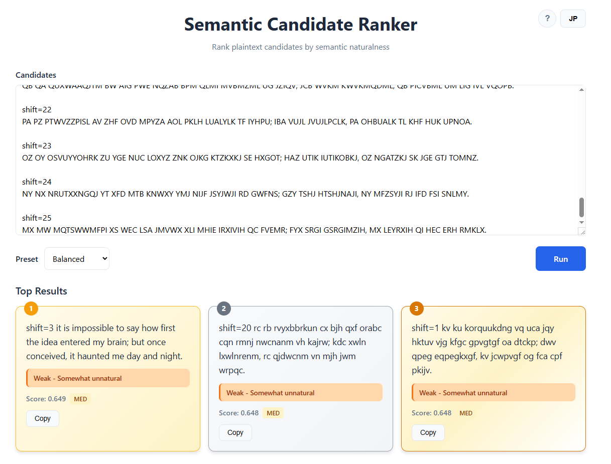

<!--
---
id: day110
slug: semantic-candidate-ranker

title: "Semantic Candidate Ranker"

subtitle_ja: "平文候補ランキングツール"
subtitle_en: "Plaintext Candidate Ranking Tool"

description_ja: "平文候補を意味的な自然さに基づいて順位付けするブラウザーベースの分析ツール"
description_en: "Browser-based tool that ranks plaintext candidates by semantic naturalness"

category_ja:
  - 暗号解析
  - 自然言語処理
category_en:
  - Cryptanalysis
  - NLP

difficulty: 4

tags:
  - embedding
  - transformers
  - semantic-similarity
  - cipher
  - offline

repo_url: "https://github.com/ipusiron/semantic-candidate-ranker"
demo_url: "https://ipusiron.github.io/semantic-candidate-ranker/"

hub: true
---
-->

# Semantic Candidate Ranker – 平文候補ランキングツール


[](https://ipusiron.github.io/semantic-candidate-ranker/)

**Day110 - 生成AIで作るセキュリティツール200**

Semantic Candidate Ranker は、**平文候補を意味的な自然さに基づいて順位付けする**ブラウザーベースの分析ツールです。

本ツールは暗号を解読・復号するものではありません。既存の解読ツールによって生成された複数の平文候補について、**どれがより「それらしい」かを判断するための補助**を行います。

---

## 🌐 デモページ

👉 **[https://ipusiron.github.io/semantic-candidate-ranker/](https://ipusiron.github.io/semantic-candidate-ranker/)**

ブラウザーで直接お試しいただけます。初回実行時にモデル（約23MB）をダウンロードします。

---

## 📸 スクリーンショット

> 
>
> *シーザー暗号文の総当たり結果を分析中*

---

## ✨ 本ツールでできること／できないこと

### できること

* 複数の平文候補を意味的に評価し、順位付けする
* 意味的自然さと参照文との近さに基づく比較
* ブラウザー上で完結（オフライン動作）
* 人間の判断を補助するための可視化

### できないこと

* 暗号の自動解読
* 鍵の推定や探索
* 正解を自動的に決定すること

本ツールは **「答えを出すAI」ではなく、「判断を助ける道具」** です。

---

## 📖 想定される利用フロー

1. 別のツールで平文候補を生成する
   * 例：[Caesar Cipher Breaker - シーザー暗号解読ツール（Day008）](https://github.com/ipusiron/caesar-cipher-breaker)
2. 平文候補を「ブロック区切り形式」で出力・コピーする
3. 本ツールに貼り付ける
4. 意味的な自然さに基づいて順位付けする
5. 上位候補を人間が確認・判断する

---

## 📝 入力形式

### 候補ブロック形式

* **1つの平文候補 = 1ブロック**
* ブロックは **空行** で区切る
* ブロック内に改行が含まれていても問題ありません

例：

```
shift=0
this is a secret message

shift=1
uijt jt b tfdsfu nfttbhf

shift=2
vjku ku c ugetgv oguucig
```

### 補足

* 空のブロックは無視されます
* 評価前に、ブロック内の改行はスペースに正規化されます
* `shift=3` のようなメタ情報行は表示用として保持されます

---

## 🌐 対応言語

### UI言語
* **日本語**（デフォルト）
* **英語**

右上の言語切り替えボタンで切り替え可能です。

### 入力・評価言語
* **英語のみ**

入力する平文候補と参照文セットは常に英語です。UIが日本語でも、評価対象は英語の平文候補となります。

---

## ⚙️ 正規化ルール

各候補は評価前に以下の正規化処理が行われます。

* すべて小文字に変換
* 改行をスペースに変換
* 連続するスペースを1つにまとめる
* 前後の空白を削除
* アポストロフィ（`'`）は保持

参照文にも同一の正規化処理が適用されます。

---

## 🔬 スコアリングの考え方

各候補は、次の2つの要素からなる合成スコアで評価されます。

### A）自然さスコア（Naturalness）

* 参照文集合の **重心（centroid）** との類似度
* 全体として英語らしいかどうかを評価

### B）参照近接スコア（Reference Proximity）

* 参照文集合のうち、類似度が高い **上位k文との平均類似度**
* 偶然の一致を減らすための指標

### 合成スコア

```
最終スコア = wA × A + wB × B
```

このスコアに基づいて順位付けが行われます。

---

## 🔬 技術的な仕組み：Embedding（埋め込み）

本ツールは、テキストの意味的な類似度を測定するために **Embedding（埋め込み）技術** を使用しています。

### Embeddingとは

Embeddingは、テキストを高次元のベクトル（数値の配列）に変換する技術です。意味的に類似したテキストは、ベクトル空間上で近い位置に配置されます。

```
"this is a secret message"  → [0.12, -0.34, 0.56, ..., 0.78]  (384次元のベクトル)
"here is a hidden message"  → [0.11, -0.32, 0.58, ..., 0.76]  (近いベクトル)
"vjku ku c ugetgv oguucig"  → [-0.45, 0.23, -0.12, ..., 0.34] (遠いベクトル/意味不明)
```

### 使用モデル

* **Transformers.js**: ブラウザー上で機械学習モデルを実行するためのライブラリー
* **all-MiniLM-L6-v2**: 文の埋め込みに特化した軽量モデル（384次元）
  * モデルサイズ: 約23MB
  * 初回実行時にダウンロードされ、ブラウザーにキャッシュされます

### 類似度の計算

2つのテキストの類似度は **コサイン類似度** で計算されます。

```
類似度 = (ベクトルAとベクトルBの内積) / (|A| × |B|)
```

* 値の範囲: -1 〜 1
* 1に近いほど意味的に類似
* 0に近いほど無関係
* -1に近いほど意味的に反対

### 処理フロー

1. 入力候補と参照文をそれぞれEmbeddingに変換
2. 参照文のEmbeddingから重心（centroid）を計算
3. 各候補と重心の類似度（自然さスコア）を計算
4. 各候補と参照文群との類似度（参照近接スコア）を計算
5. 合成スコアで順位付け

すべての処理はブラウザー内で完結し、外部サーバーへのデータ送信は行いません。

---

## ⚙️ プリセット

過度な調整による誤解を防ぐため、自由なスライダーではなくプリセット方式を採用しています。

| プリセット        | wA  | wB  | k | 説明           |
| ------------ | --- | --- | - | ------------ |
| Balanced（既定） | 0.5 | 0.5 | 5 | バランス重視       |
| Naturalness  | 0.7 | 0.3 | 5 | 英語らしさ重視      |
| Reference    | 0.3 | 0.7 | 5 | 参照文との近さ重視    |
| Strict       | 0.5 | 0.5 | 3 | 保守的（偶然一致を抑制） |
| Broad        | 0.5 | 0.5 | 7 | 寛容（広く類似を拾う）  |

---

## 📚 参照文セットについて

* 内蔵（ユーザー入力不可）
* 約300文の短い英語文
* 文体を混在

  * 会話文
  * 叙述文
  * 技術文
  * その他一般文
* 固有名詞は少なめ

### この設計の理由

* 暗号文の平文は句読点や整形が失われがち
* 特定文体への偏りを防ぐため
* 部分的な平文でも評価しやすくするため

---

## 📊 評価コメント

トップ結果には、スコアに基づく評価コメントが表示されます。

| 評価   | スコア範囲    | 説明             |
| ---- | -------- | -------------- |
| 優秀   | 0.85以上   | 非常に自然な表現       |
| 良好   | 0.75–0.85 | 自然で流暢          |
| 普通   | 0.65–0.75 | やや自然           |
| 弱い   | 0.55–0.65 | やや不自然          |
| 不良   | 0.55未満   | 自然な文ではない可能性    |

---

## 📊 Confidence（信頼度）表示

候補の文字数に応じて、信頼度を表示します。

| 信頼度    | 文字数      |
| ------ | -------- |
| Low    | 40文字未満   |
| Medium | 40–120文字 |
| High   | 120文字以上  |

短い候補は意味評価が不安定になりやすいため、過信を防ぐ目的で表示されます。

---

## ⚡ 制限とパフォーマンス

* 最大候補数：**200**
* 処理時間の目安：**20秒以内**（候補数や環境により変動）

### 処理ステップ表示

1. モデルの読み込み
2. 候補文の準備
3. 参照文の準備
4. 類似度計算
5. 順位付け

処理はいつでもキャンセル可能です。

---

## 🌐 ネットワークポリシー

* **初回実行時**：機械学習モデル（約23MB）をダウンロード
* **2回目以降**：完全オフライン動作（モデルはブラウザーにキャッシュ）
* 外部API通信なし
* テレメトリーなし
* 入力データは外部に送信されません

モデルはHugging Faceからダウンロードされ、ブラウザーのIndexedDBにキャッシュされます。

---

## 🖥️ UIの機能

* **言語切り替え**: 右上のボタンでUI言語を日本語/英語に切り替え
* **ヘルプモーダル**: 「?」ボタンで使い方を表示
* **コピーボタン**: 各結果カードからテキストをコピー
* **オフラインインジケーター**: ネットワーク切断時に表示

---

## 🔒 セキュリティ

本ツールは以下のセキュリティ対策を実装しています。

* **Content Security Policy (CSP)**: XSS攻撃を防止
* **入力サニタイズ**: HTMLエスケープによるXSS対策
* **外部通信なし**: 初回モデルダウンロード後は完全オフライン
* **データ送信なし**: 入力内容は外部に送信されません

---

## 🎯 想定用途

* 古典暗号解読の学習・教育
* 平文候補の比較・仮説検証
* 意味的な自然さの可視化

暗号学的な安全性評価や自動判定を目的としたものではありません。

---

## 📁 ディレクトリー構造

```
semantic-candidate-ranker/
├── index.html                  # メインHTMLファイル
├── js/
│   ├── app.js                  # アプリケーションコントローラー
│   ├── embedder.js             # Transformers.jsラッパー
│   ├── i18n.js                 # 国際化（日本語/英語）
│   ├── normalizer.js           # テキスト正規化
│   ├── reference-sentences.js  # 参照文セット
│   ├── scorer.js               # スコアリングアルゴリズム
│   └── ui.js                   # UI操作
├── style/
│   ├── style.css               # 基本スタイル
│   ├── style-mobile.css        # モバイル用スタイル
│   ├── style-tablet.css        # タブレット用スタイル
│   └── style-laptop.css        # デスクトップ用スタイル
├── docs/
│   ├── SPEC.md                 # 機能仕様書
│   ├── UI_SPEC.md              # UI仕様書
│   ├── ALGORITHM.md            # スコアリングアルゴリズム詳解
│   ├── EMBEDDING.md            # Embedding技術詳解
│   └── REFERENCE_DESIGN.md     # 参照文セット設計
├── README.md                   # 本ドキュメント
├── LICENSE                     # ライセンスファイル
└── CLAUDE.md                   # Claude Code設定
```

---

## 📄 ライセンス

- ソースコードのライセンスは `LICENSE` ファイルを参照してください。
- [Transformers.js](https://github.com/xenova/transformers.js) を利用しており、そのライセンスに従います。

---

## 🛠️ このツールについて

本ツールは、「生成AIで作るセキュリティツール200」プロジェクトの一環として開発されました。
このプロジェクトでは、AIの支援を活用しながら、セキュリティに関連するさまざまなツールを200日間にわたり制作・公開していく取り組みを行っています。

プロジェクトの詳細や他のツールについては、以下のページをご覧ください。

🔗 [https://akademeia.info/?page_id=44607](https://akademeia.info/?page_id=44607)
